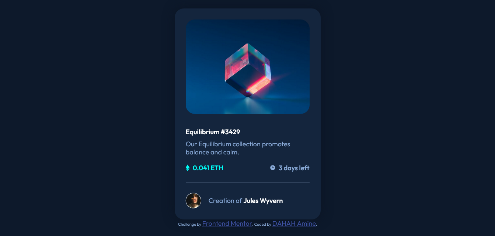

# Frontend Mentor - NFT preview card component solution

This is a solution to the [NFT preview card component challenge on Frontend Mentor](https://www.frontendmentor.io/challenges/nft-preview-card-component-SbdUL_w0U). Frontend Mentor challenges help you improve your coding skills by building realistic projects. 

## Table of contents

- [Frontend Mentor - NFT preview card component solution](#frontend-mentor---nft-preview-card-component-solution)
  - [Table of contents](#table-of-contents)
    - [The challenge](#the-challenge)
    - [Screenshot](#screenshot)
    - [Links](#links)
  - [My process](#my-process)
    - [Built with](#built-with)
    - [What I learned](#what-i-learned)
    - [Continued development](#continued-development)
  - [Author](#author)

### The challenge

Users should be able to:

- View the optimal layout depending on their device's screen size
- See hover states for interactive elements

### Screenshot




### Links

- Solution URL: [Github Repo](https://github.com/aminedh27/nft-preview-card-component)
- Live Site URL: [Github Pages](https://aminedh27.github.io/nft-preview-card-component/)

## My process

### Built with

- Semantic HTML5 markup
- CSS custom properties
- Flexbox
- Mobile-first workflow


### What I learned

While solving this challenge I learned how to really work with flex and using it in real time projects, this challenge helped a lot on the understanding of how css works

these are some code that I wrote by my self without any help


```css
.text {
  color: hsl(215, 51%, 70%);
  display: flex;
  flex-direction: column;
  justify-content: space-between;
}
.NFTcard {
  background-color: hsl(216, 50%, 16%);
  width: 25vw;
  height: 80vh;
  border-radius: 25px;
  padding: 30px;
  display: flex;
  flex-direction: column;
  justify-content: space-between;
  box-shadow: 0 0 30px hsl(217, 54%, 9%);
}
```

### Continued development

I will be focusing on learning how to make my CSS code responsive and works on any device and also when to use the explicit and implicit units

## Author

- Website - [DAHAH Amine](https://github.com/aminedh27)
- Frontend Mentor - [@aminedh27](https://www.frontendmentor.io/profile/aminedh27)
- Twitter - [@Amine_DH27](https://twitter.com/Amine_DH27)


